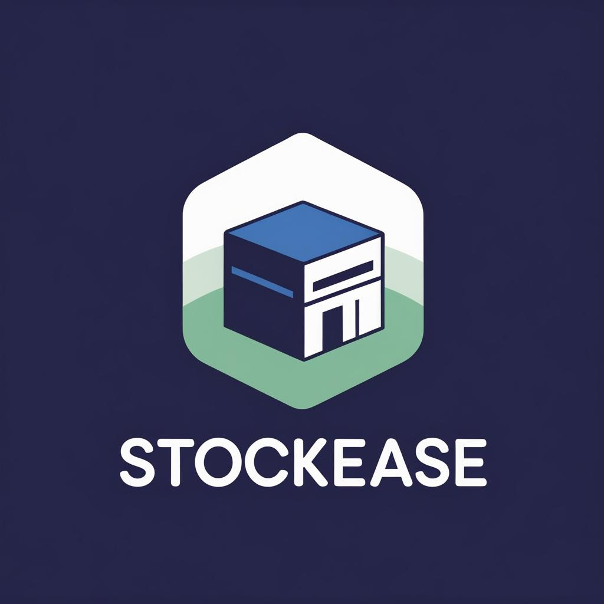
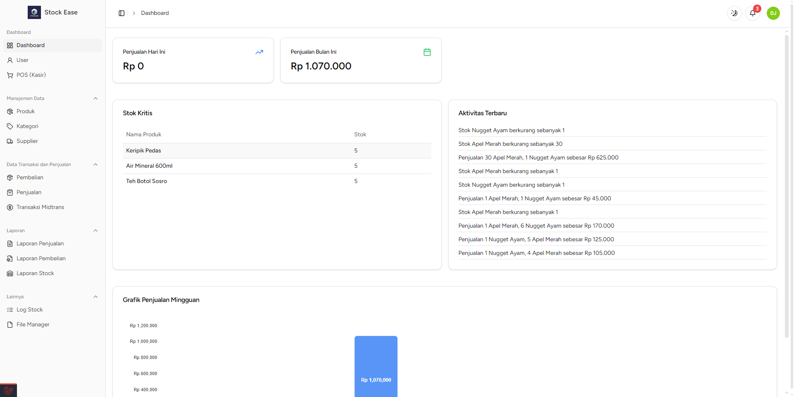
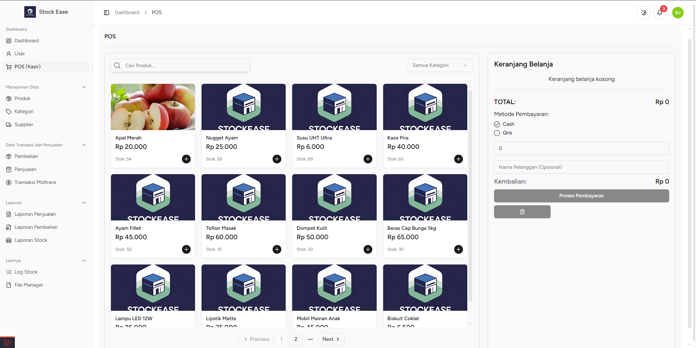
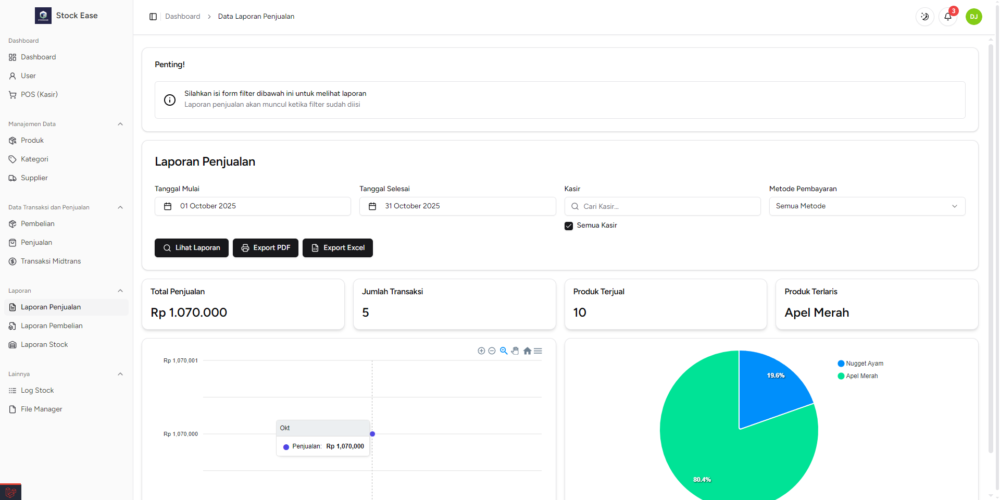

<h1 align="center" style="font-size: 3rem">StockEase</h1>

<a href="https://github.com/DewaJayon/StockEase">
    <p align="center">
        
    </p>
</a>

<p align="center">
    <b>Sistem Manajemen Gudang dan Point of Sale (POS)</b><br>
    <i>Dikembangkan dengan Laravel + Inertia.js (Vue.js)</i>
</p>

---

## 📌 Deskripsi

**StockEase** adalah aplikasi berbasis web yang dirancang untuk membantu manajemen gudang, penjualan, serta kasir dalam satu sistem terpadu.  
Proyek ini ditujukan untuk mempermudah pengelolaan stok, transaksi, laporan, dan kontrol akses berdasarkan peran pengguna (**admin, cashier, warehouse**).

---

## 🖼️ Preview

<p align="center">
    
</p>

<p align="center">
    
</p>

<p align="center">
    
</p>

---

## 🚀 Fitur Utama

Berikut adalah fitur utama yang sudah tersedia (lihat [TODO List](.github/TODO.md) untuk detail lengkap):

### 🔑 Role & Akses

-   **Dashboard** (admin, cashier, warehouse)
-   **POS (Kasir)** (admin, cashier)
-   **User Management** (admin)

### 📦 Manajemen Data

-   Produk (admin, warehouse)
-   Kategori (admin)
-   Supplier (admin, warehouse)

### 💰 Transaksi

-   Pembelian (admin, warehouse)
-   Penjualan (admin, cashier)
-   Transaksi pembayaran dengan **Midtrans**

### 📊 Laporan

-   Laporan Penjualan (admin, cashier)
-   Laporan Pembelian (admin, warehouse)
-   Laporan Stok (admin, warehouse)
-   Export laporan ke **Excel** & **PDF**

### 📂 Lainnya

-   Log Stok
-   File Manager
-   Profile User
-   Pengaturan (admin) _(coming soon)_

### ✨ Fitur Tambahan

-   Notifikasi di Dashboard
-   Integrasi Payment Gateway (Midtrans)
-   Filter tanggal pada data penjualan & pembelian
-   Print detail data penjualan
-   Export laporan (Excel/PDF)
-   Scan barcode otomatis masuk keranjang kasir _(coming soon)_

---

## 🛠️ Teknologi yang Digunakan

-   **Laravel 12**
-   **Inertia.js**
-   **Vue.js 3**
-   **TailwindCSS + ShadCN UI**
-   **Midtrans Payment Gateway**
-   **MySQL** sebagai database utama

---

## 📥 Instalasi

1.  Clone repositori ini:

    ```bash
    git clone https://github.com/DewaJayon/StockEase.git

    cd StockEase
    ```

2.  Install dependency PHP & Node.js:

    ```bash
    composer install

    npm install && npm run build
    ```

3.  Copy file `.env.example` dan sesuaikan konfigurasi:

    ```bash
    cp .env.example .env

    php artisan key:generate
    ```

4.  Migrasi database:

    ```bash
    php artisan migrate --seed
    ```

5.  Jalankan aplikasi:

    ```bash
    php artisan serve

    npm run dev
    ```

## 👨‍💻 Kontributor

-   **Dewa Jayon** ([Github](https://github.com/DewaJayon))
